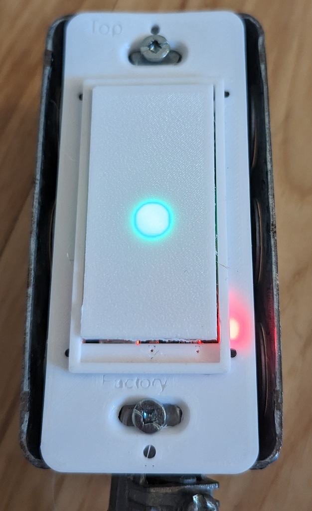

## Introduction
This project will be an open source ESP32 based Wifi MQTT light switch. My intention is to make a device that will fit into a "Decor" style switch box. Sonoff devices are interesting but they do not fit into a regular box along side other non-smart switches. 

At the heart of the project are two custom designed PCBs. There is a power board that handles the SPDT relay for AC switching, the conversion of the AC in to DC and provides both 5 volts DC and 3.3 volts DC to the controller board. The controller board has the ESP32 for control, communications and the buttons for triggering. There is a "light" button and a "factory" button. The light button is of course used to turn the light on and off while the factory button is used to do a factory reset. There is a Neopixel on the control board to indicate the status of the device in addition to a dedicated power led. [Here is a link](https://oshwlab.com/bhboyle/esp32-light-switch) to the EasyEDA project.

For safety and simplicity sake, I used the [Mean Well IRM-02-5](https://www.digikey.ca/en/products/detail/mean-well-usa-inc/IRM-02-5/7704628?s=N4IgTCBcDaIIwA4BsSC0BmADJgnKgcgCIgC6AvkA) 2 watt AC-DC converter. As with most things it is a compromise. In this case between simplicity, size, safety and cost. It is a little on the pricy side at $10 USD each but it makes it very simple to build the power supply and because it is a sealed housing it is nice and safe. This module creates 5 volts DC that drives the relay and the Neopixel and I use an LDO linear regulator to generate the 3.3 volts the ESP32 needs to operate.

The Preferences library is used to store the variables in the NV ram for retrieval after a power down.

Version one of the project is essentially completed. It is working and I am very happy t=with how the elements have all come togther to create what I feel is a great little DIY IOT light switch.

Version two is in the works and I have completed the board design for the upgrade. I have ordeered some of teh parts and will be ordering the new boards shortly.

## First test switch working!
So the first switch is up and running and working well. The 3D model took a fair bit of time to get right and went through several revisions for each of the peaces to get the fitting just right. This is all on version one of the hardware. As I have said, I have already updated the boards to allow for the use of a hall effect current monitoring sensor to determine if the circuit is active regardless of relay state. This means that some things are going to have to move in the housing to accommodate the new boards. 

The bad news is that the sensor I wanted to use is currently experiencing stock issues. I switched to the [	
MCS1802GS-10](https://www.digikey.ca/en/products/detail/monolithic-power-systems-inc/MCS1802GS-10-Z/14115509). I am going to proceed with ordering the next version of the boards from JLCPCB after I have updated the circuit to accomidate the new current sensor.

Currently there are several web pages built into the current firmware. In a configured switch there is a root web page that allows you to see the current switch state as well as change it state. Also there is a link to the settings page that lets you adjust the settings you entered during initial setup. This would be useful if you had to change the MQTT server settings of even wifi settings. There is also an /info page that displays a JSON page that contains the current status of the switch and lastly there is a /update page that lets you upload news firmware over the air.

I think there is still lots of work to be done but I am very happy with how this project is moving forward.

## Todo
1. Finalize the hardware design and order boards and parts for testing. **Boards have arrived and are currently being tested**
    * First version of the board have arrived and I found my first mistake. I did not connect the USB 5 volt source to the output of the on board power supply. This means that the on board 3.3 volt regulator is not powered when connected to the USB and so the board is not programmable when powered ony by the USB port. It has to be powered by AC also for it to be programmable. 
    * This has been updated in the schematic for the next version. I have not moved the next version of the Schematic into this repo yet as I want to order the new boards and test them first.
2. Define the software requirements **Done (at least for now)**
3. Complete the software for the ESP32-S3 **This is almost done**
4. Design the enclosure in Fusion 360 **Done for version one of the boards. Version two will need some tweaks for the new board layouts.**
5. Print and test the enclosure. **Initial testing is underway using PETG and I am happy so far.**

## Features to add
1. Over the Air updates **added using the [ElegantOTA lib](https://github.com/ayushsharma82/ElegantOTA). Tested and working**
2. Web server available at all times to look at status, variables and configuration **Tested and working**
3. Light switch works no matter what even before being configured **Tested and working**
4. MQTT triggering via node-red **Tested and working** 
5. Triggering via Wed interface **Tested and working**
6. Fits into a standard wall box in North America **Tested and working**
    * This looks like it should not be a problem because this first version is smaller than a TP-Link smart switch I have been using as a size reference. 
7. Standard Normally open switching and three way switching **I used a SPDT relay so this can be used as a normal switch if you use the common and the noramally open terminal or it can be used as a three way switch by using both the noramaly open and the noramaly closed terminal. Please note that the hot input(common) must aways have power for the device to function. Also a nuetral is required to power the device.**
8. If I can figure it out, I would like the switch to know if the switched circuit is active. Meaning, if the switch is on. This will require a means to measure the current on the switched side. This is only useful in the 3-way mode as it does not necessarily matter what state the relay is in for the circuit to be on.  
    * I have found the ACS712 this is a very interesting device that uses the Hall effect to measure the AC current without directly connecting its output to the AC voltage. There are quite a few variants of this device but this one runs on 3.3 volts so it is compatible with the ESP32 and it measures up to 10 amps so it is right in the ball park with the capacity of the relay I am using. I am updating the schematic for the next version that I will eventually order.  
    * So after some more research I have discovered that the ACS712 may well be perfect for this project. It has a maximum current handling capacity of 55 amps, way more than I would ever need. Which I like in terms of having lots of overhead for a safety margin. Also it can be used, through software, to determine how much power is being used over time. This is huge.

9. LED colors. Red - Boot up, Yellow - WIFI connected, Green - WIFI and MQTT connected, Blue = AP is active. **Done**
10. Remember power state for power failures using preferences **Tested and working**

### Build environment
Just in case it is not obvious, I wanted to mention that the project is being working on in VScode with the PlatformIO plugin. If you choose to compile the code in the Arduino IDE you simply need to get the main.cpp file from the SRC folder and put it in to your sketch folder. You will also need to gather and install the needed libraries.

### DISCLAMER
Please understand that this project uses mains power and if you do not know what your doing you can seriously harm or even kill youself. In some places you may not even be leagally allowed to install electrical equipment if you are not a licensed electrition. PLEASE be careful and if you are not confident do not do electrical work yourself. ** You have been warned **
