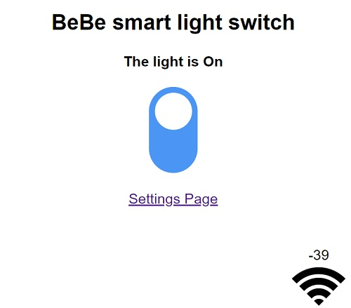
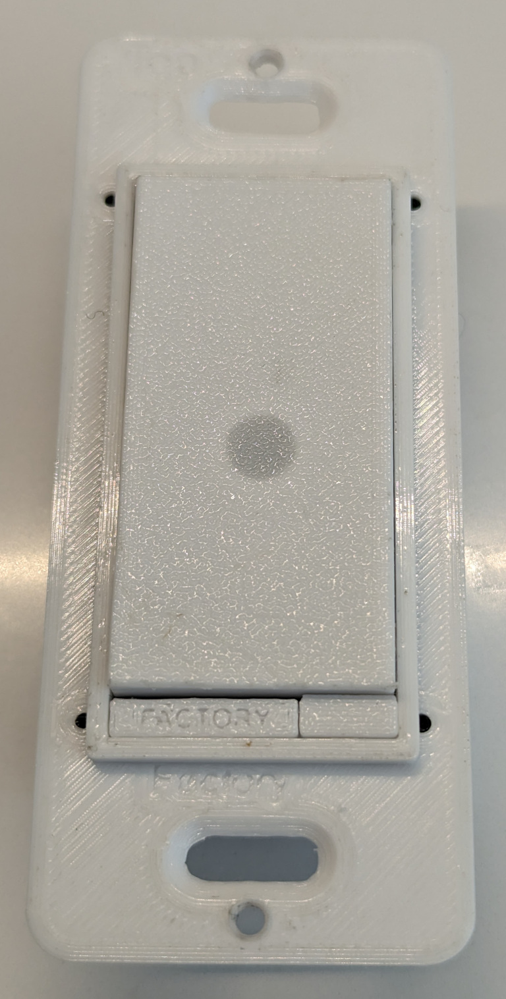

## Issues
I have now ordered version three of the power board. It uses a CSE7759 energy metering chip that uses a 1mO shunt resistor to measure the current flowing through the switch. I will have to modify the current monitoring code fairly heveily for the new energy metering to work. More to come... 

Prior to June 6th 2023 Resistor R2 on the main control board was incorrect and has been replaced. It should have been a 10K. It has been updated in the schematic but if you have ordered any boards before now you will have to replace the resistor manually. 

## Introduction
This project is an open source ESP32 based Wifi MQTT light switch. The device fits into a "Decor" style switch box. Sonoff devices are interesting but they do not fit into a regular box along side other non-smart switches.

I have gone through the first iteration of the design that does not include current sensing on the output. This version would work fine as a single on off switch but I would like this switch design to work for both single on/off switches and for three way switches as well. This requires current sensing that will be explained later.

## Objective
My objective for this project was explained at a high level in the introduction section but that does not explain my motivation for this project. Several years ago I had installed several TP-link smart switches in my home. All within a month of each other. Five years later they all died within a month of each other. That seemed like too much of a coincidence to me so I decided to make my own. This project is the idea come to life.

## Features
I will use an integrated web server for manage the following features
 * Web based control of the switch
 * Web based status of switch
 * Web based OTA updates of the switch firmware
 * Web based settings update
 * Stand alone AP mode for initial configuration
 * Remember power state for power failures using preferences lib
 * LED colors. Red = Boot up, Yellow = WIFI connected, Green = WIFI and MQTT connected, Blue = AP is active.
 * Fits into a standard wall box in North America as a Decor style switch
 * 3D models for 3D printing the housing for the parts
 * Links to the schematic and PCB designs for easy board ordering
 * LED Indication of relay status. "Breathing" LED means relay is off. Solid LED means Relay is on.
 * MQTT control of the switch
 * MQTT status of switch

## Design
At the heart of the project are two custom designed PCBs. There is a power board that handles the SPDT relay for AC switching, the conversion of the AC in to DC and provides both 5 volts DC and 3.3 volts DC to the controller board. The controller board has the ESP32 for control, communications and the buttons for triggering. There is a "light" button and a "factory" button. The light button is of course used to turn the light on and off while the factory button is used to do a factory reset. There is a Neopixel on the control board to indicate the status of the device in addition to a dedicated power led. [Here is a link](https://oshwlab.com/bhboyle/esp32-light-switch) to the EasyEDA project. This link will give you access to the schematics and board layouts. From there you can directly order boards from JLCPCB.

For safety and simplicity sake, I used the [Mean Well IRM-02-5](https://www.digikey.ca/en/products/detail/mean-well-usa-inc/IRM-02-5/7704628?s=N4IgTCBcDaIIwA4BsSC0BmADJgnKgcgCIgC6AvkA) 2 watt AC-DC converter. As with most things it is a compromise. In this case between simplicity, size, safety and cost. It is a little on the pricy side at $10 USD each but it makes it very simple to build the power supply and because it is a sealed housing it is nice and safe. This module creates 5 volts DC that drives the relay and the Neopixel. In addition to the 5V power supply, I use an LDO linear regulator to generate the 3.3 volts the ESP32 needs to operate.

### The PCBs
I have designed the boards in EasyEDA. Because if this ordering from JLCPCB is very easy. I have JLCPCB populate the boards. For the power/switching board I have them populate the back of the board which is all SMB components. the front side of the board has the power supply, relay, power connection terminals and the current monitor. They all have to be manually soldered. There are also a few discrete SMB components that have to be manually soldered. The control board I ordered fully populated except for the board to board connector because I prefer to manually solder it myself. 

In order to use this as a three way switch and have the device be aware of whether or not the lighting circuit is live or not you need to measure the current flowing through the lighting circuit. This is required because it is possible, in a three way circuit for the circuit to be live without the SPDT relay being engaged due to the nature of three way circuits. Anyone who has used an three light switch knows that the two switches can end up in any position. Because of this, I use a Hall effect current sensor to determine if the lighting circuit is live or not. This has the added benefit of being able to determine how much power the circuit is using over time. Code for this part of the project is still being worked on.

I have updated the power supply board to include a LC filter on the 3.3 volt line. I have not tested this yet and it yet but it is a standard LC filter and I used a LC simulator to get near -80DB on all noise so it should work just fine. I have included an indicator to the schematic if you want to remove the filter from the circuit.

## Programming
Programming the device the first time has to be done via the USB C connector before the device is assembled. Once the initial programming is done the device can be programmed via the web interface by going to the following URL: http://deviceIp/update From here you can upload the firmware generated from platformIO.

## Todo
* The biggest remaining item on the list of things to do at this point is documentation and code optimization. 

### Parts List
[Here is a file](https://docs.google.com/spreadsheets/d/1vnkWm73apcbOtNqYmAgQMh_5zk3PtoovNklXcG1IaSc/edit?usp=sharing) that has links to the most of the harder to find parts or just parts that you have to solder yourself. 

### Software Build environment
Just in case it is not obvious, I wanted to mention that the project is being worked on in VScode with the PlatformIO plugin. If you choose to compile the code in the Arduino IDE you simply need to get the main.cpp file from the SRC folder and put it in to your sketch folder. You will also need to gather and install the needed libraries.

### DISCLAMER
Please understand that this project uses mains power and if you do not know what you're doing you can seriously harm or even kill yourself. In some places you may not even be legally allowed to install electrical equipment if you are not a licensed electrician. PLEASE be careful and if you are not confident do not do electrical work yourself. **You have been warned**

  
